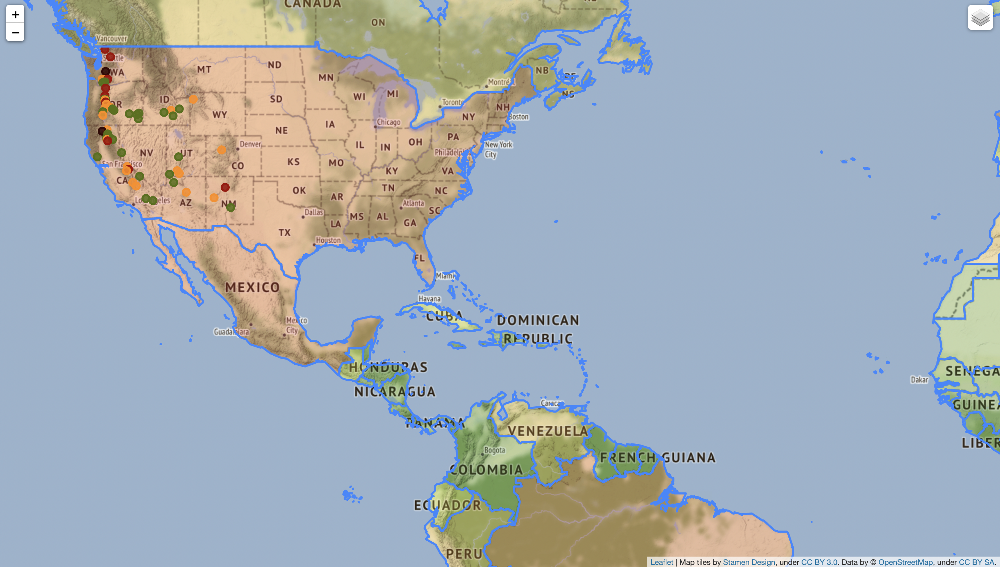

# Interactive-Web-Map
This program consists in an interactive web map that shows volcanoes in the US, as well as a population scale for every country.
For this program, the folium library was used, besides simple HTML and Pandas, to style a bit, and extract the data used to create the program, respectively.
Later, I will implement a geolocation system in the map.
### Pictures of the map:

Credits to Ardit Sulce, professor of the course I'm taking on Udemy, where I learned about the Folium library, and where I got the csv and json files used in the program.
 
Link to the course: <a href="https://www.udemy.com/course/the-python-mega-course/?src=sac&kw=the+python+mega+course">Udemy course</a>